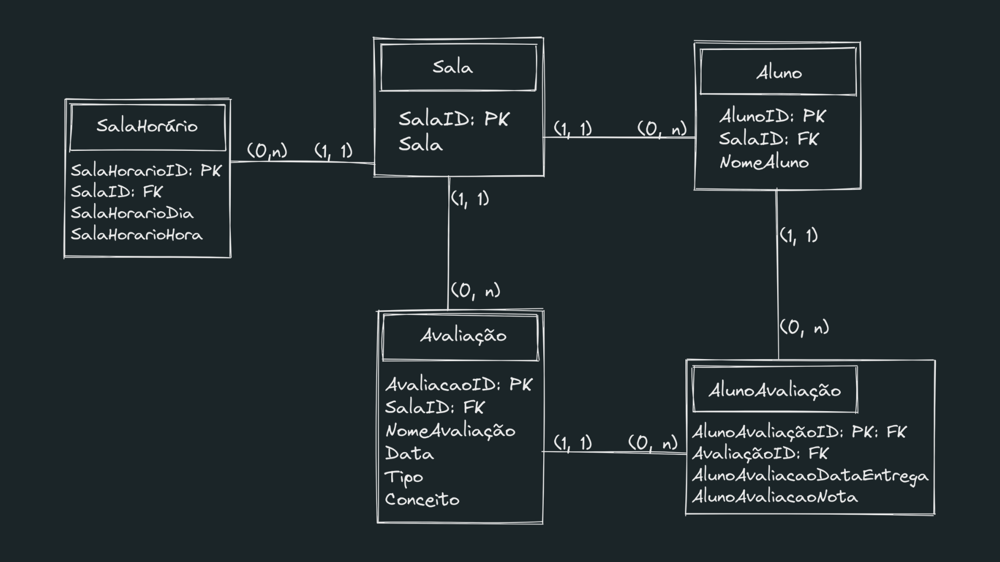
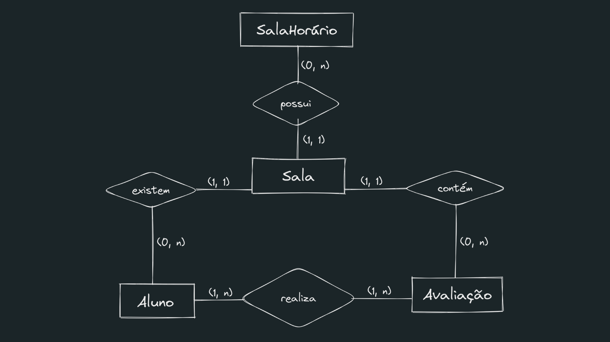

# PARE
Plataforma de Acompanhamento de Rendimento Escolar
---

## Sumário:
* [Apresentação da Equipe](#apresentação-da-equipe)
* [Objetivo](#objetivo-do-produto)
* [Tecnologias](#tecnologias-utilizadas)
* [Banco de Dados](#banco-de-dados)
* [Protótipo](#protótipo-wireframe)
* [Backlog](#backlog-do-produto)
* [Planejamento de Entregas](#planejamento-de-entregas)

## Apresentação da Equipe:
Somos uma equipe de jovens programadores interessados em criar soluções simples para problemas complexos e em aprender o máximo possível no processo.
Nosso foco é identificar a principal finalidade de um produto para desenvolver soluções de maneira gradual e modular em torno deste objetivo, de forma que cada passo possa ser validado pelo(a) cliente e/ou usuários e o produto evolua organicamente.

## Integrantes:

#### Devs:
* [Alita Willians da Silva Amancio](https://github.com/AlitaAmancio)
* [Amanda Mendes Caldeira](https://github.com/AmendoaM)
* [Jonas Alves Bueno](https://github.com/dodekafonos)
* [Michael Morais](https://github.com/itsmorais)
* [Vitor F. Morais](https://github.com/vmorais111)
#### Product Owner:
* [Jean Cesar de Oliveira Rodrigues](https://github.com/JeanRodrigues1)
#### Scrum Master:
* [Alexandre Jonas de Souza Fonseca](https://github.com/AlexandreJonas)

## Objetivo do Produto:
O objetivo do projeto é desenvolver uma plataforma desktop na linguagem Java que auxilie professores no processo de documentação de provas e trabalhos, além de facilitar o acompanhamento do desempenho individual dos alunos e das turmas. Na plataforma PARE poderão ser cadastradas novas atribuições, cada qual com suas especificidades, datas de entrega e opções pertinentes a cada aluno, como a própria nota ou as informações de entrega.

## Tecnologias Utilizadas

* Java: Linguagem de programação utilizada na resolução do problema.
* Trello: Ferramenta visual e colaborativa que auxilia no gerenciamento de projeto e fluxo de trabalho.
* Apache NetBeans: Ambiente de desenvolvimento. 
* Discord: Plataforma utilizada para realização de reuniões da equipe.
* Figma: Prototipagem.
* GitHub: Controle de versionamento, documentação e colaboração.
* MySQL: Banco de Dados utilizado.

## Banco de Dados:
O banco de dados trabalhado nesse projeto é o [MySQL](https://www.mysql.com/) e nele serão armazenadas informações referente às instituições, salas, alunos e atividades. Segue abaixo os Modelos Lógico e Conceitual pensados para a primeira Sprint, onde constam as Entidades, seus Atributos e relações: 

### Modelo Lógico:

### Modelo Conceitual:

## Protótipo (Wireframe)
### Vídeo Demonstrativo
[apiFigma.webm](https://user-images.githubusercontent.com/53665466/229374066-6726121a-f0a8-454c-9545-9b427cc361d7.webm)

### Link Figma
[Neste link](https://www.figma.com/file/0Ryi85LRWO7ZbmtkwX3PGo/Cadastro-Michael?fuid=1144429158156920531) é possível visualizar o protótipo das telas pensadas, como a inicial, a de busca e de cadastro.

## Backlog do Produto:
### User Stories:

## Planejamento de Entregas:

